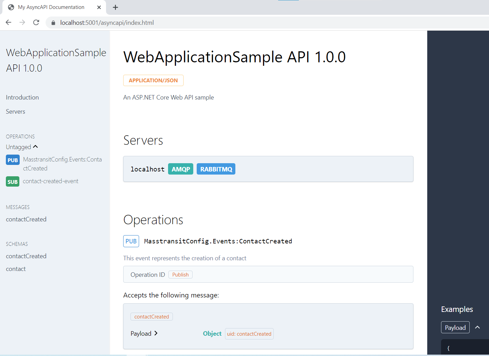

# Async API with masstransit and rabbitmq

An example of a dotnet application with usage of [MassTransit](https://masstransit-project.com/) 
with rabbitmq broker and the documentation generated following the [AsyncAPI specification](https://www.asyncapi.com/) 
by [Saunter](https://github.com/tehmantra/saunter) package.  

## Run
To run this application just execute `dotnet run --project src/WebApplicationSample/WebApplicationSample.csproj`

> You must have the dotnet installed. 

# Docker compose

To run the rabbit container execute `docker-compose up -d`, the docker-compose file is on the root folder.

Access the default host:port `http://localhost:15672/` and login with the default `guest` user and password. 

> You must have docker installed

# Docker image

Preconfigured Docker image, based on default management-alpine image, maintained by MassTransit, including the delayed exchange plug-in, as well as the Management interface enabled.

- [masstransit/rabbitmq](https://hub.docker.com/r/masstransit/rabbitmq)

References default image base:

- [rabbitmq](https://hub.docker.com/_/rabbitmq/)